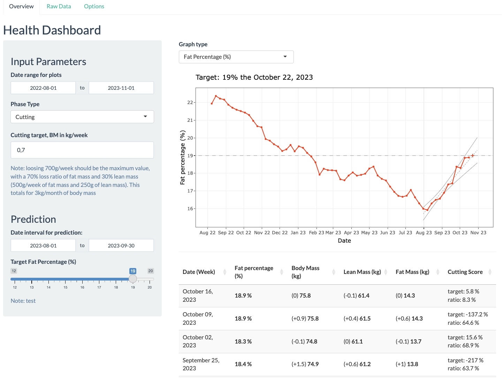

# Dashboard for tracking health key values
## Description
An compact health monitoring panel for observing health metrics over a period of time. 
The weight, specifically focused on achieving weight loss goals, is the primary health metric in this scenario. This dashboard facilitates comprehension of the patterns in crucial health values through visual graphs and tables.

## Preview

 
